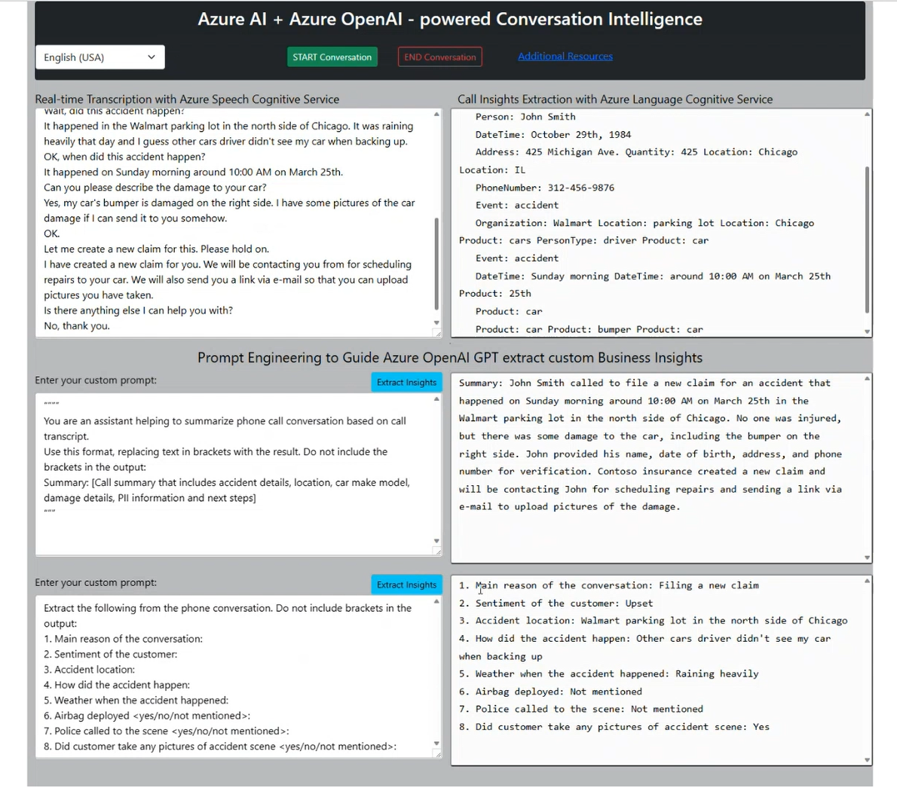
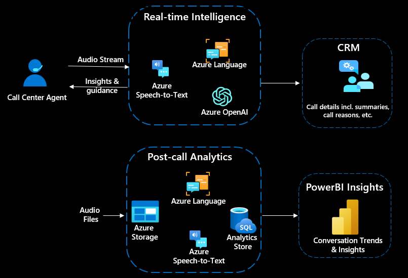

# AI Powered Call Center Intelligence Accelerator

The Call Center Intelligence Accelerator drives huge cost saving in call center operations while improving call center efficiency & customer satisfaction.

It uses Azure Speech, Azure Language and Azure OpenAI (GPT-3) services to analyze call center transcrips, extract and redact personally identifiable information (PII), summarize the transcription, and provides rich business insights that could be used in real-time. It delivers deeper business insights for managers and enables them to evaluate call center performance far more efficiently and effectively in real-time and batch scenarios. Data insight on customer sentiment, topic analysis, and other valuable call attributes are served up in a user-friendly visual dashboard in Power BI.

The diagram below depicts key business outcomes that this solution could help accelerate

This is a sample accelerator for Call Center Intelligence powered by Azure AI (including new Azure OpenAI GPT-3). It shows how Azure AI services could be used both in real-time and post-call analytics scenarios for an Intelligent Contact Center.

This solution accelerator has two main components:
1. **`Real-time Intelligence`** component: Real-time transcription and analysis of a call to improve the customer experience by providing insights and suggest actions to agents. This can help with agent-assist and virtual agents use cases. Key technical components of this part of the accelerator are:
    * Transcription of live audio stream using Azure Speech Service
    * Entity extraction + PII detection and redaction using Azure Language Service
    * Conversation summarization using Azure OpenAI Service
    * Extract business insights & conversation details using Azure OpenAI Service

This is a web-based app that enables you to simulate Agent-Customer interactions (in any line of business) and shows the power of Azure AI to augment the human and acts as a **very effective copilot** (screenshot below)

**To setup and run this solution component**, please refer to [Real-time Intelligence](call-intelligence-realtime/README.md) for step-by-step instructions.

2. **`Post-call Analytics`** component: Post-call analysis to create insights into customer conversations to improve understanding and support continuous improvement of call handling, optimization of quality assurance and compliance control as well as other insight driven optimizations. Key technical components of this part of the accelerator are:
    * Batch speech-to-text using Azure Speech: Transcribe large amounts of audio files asynchronously including speaker diarization and is typically used in post-call analytics scenarios. Diarization is the process of recognizing and separating speakers in mono channel audio data.    
    * Personally Identifiable Information (PII) extraction and redaction: Identify, categorize, and redact sensitive information in conversation transcription.
    * Sentiment analysis and opinion mining: Analyze transcriptions and associate positive, neutral, or negative sentiment at the utterance and conversation-level.
    * Visualize insights using Power BI

    **To setup and run this solution component**, please refer to [Post-call Analytics](postcall-analytics-azure/README.md) for step-by-step instructions.

This solution accelerator is modular and above two parts can be used independently of each other, if needed. i.e Real-time Intelligence and Post-call Analytics components can be used independently.

The diagram below depicts key components and Azure services used in this sample accelerator.

## Contents

Outline the file contents of the repository. It helps users navigate the codebase, build configuration and any related assets.

|Solution accelerator component| Folder                              | Description                                |
|------------------------------|-------------------------------------|--------------------------------------------|
|Real-time Intelligence    | [call-intelligence-realtime](call-intelligence-realtime)    | Web application & APIs that simulates real-time call intelligence. It performs real-time conversation transcription and extracts conversation information (including PII detection + redection). It also includes features to generate conversation summary using Azure OpenAI GPT-3 model along with ability to extract business insights in near real-time        |
|Post-call Analytics    | [postcall-analytics-azure](postcall-analytics-azure)      | ARM template file and deployment guide for performing ingestion & batch analytics of calls using various Azure AI services. This part of the accelerator can be to perform analytics on call recordings and does not require integration with telephony or other live-audio capturing mechanism.   |
|Post-call Analytics    | [postcall-analytics-powerbi](postcall-analytics-powerbi)                  | Template files and deployment guide for visualizing call insights using Power BI.      |
|(Optional) Real-time Intelligence or Post-call Analytics| [azure-custom-speech](azure-custom-speech)              | You could use standard Azure Sample data and instructions to create custom transcription model using Azure Speech service. This step produces a custom speech model. This step is OPTIONAL.                  |

## Prerequisites

* An existing [Azure Account](https://azure.microsoft.com/free/)
* Ensure you have [Node.js](https://nodejs.org/en/download/) installed. Required for `Real-time Intelligence` only.
* Ensure you have [Power BI](https://powerbi.microsoft.com/en-us/downloads/) installed. Required for `Post-call Analytics` only.

## Dependencies

This accelerator is modular and some parts can be used independently and some components depend on other steps to be completed. In summary, real-time and post-call analytics can be used independently. Above table highlights key components of this solution.

## Getting started

Follow the individual instructions for each step of the accelerator provided within above `Folders`.

## License
Copyright (c) Microsoft Corporation

All rights reserved.

MIT License

Permission is hereby granted, free of charge, to any person obtaining a copy of this software and associated documentation files (the ""Software""), to deal in the Software without restriction, including without limitation the rights to use, copy, modify, merge, publish, distribute, sublicense, and/or sell copies of the Software, and to permit persons to whom the Software is furnished to do so, subject to the following conditions:

The above copyright notice and this permission notice shall be included in all copies or substantial portions of the Software.

THE SOFTWARE IS PROVIDED AS IS, WITHOUT WARRANTY OF ANY KIND, EXPRESS OR IMPLIED, INCLUDING BUT NOT LIMITED TO THE WARRANTIES OF MERCHANTABILITY, FITNESS FOR A PARTICULAR PURPOSE AND NONINFRINGEMENT. IN NO EVENT SHALL THE AUTHORS OR COPYRIGHT HOLDERS BE LIABLE FOR ANY CLAIM, DAMAGES OR OTHER LIABILITY, WHETHER IN AN ACTION OF CONTRACT, TORT OR OTHERWISE, ARISING FROM, OUT OF OR IN CONNECTION WITH THE SOFTWARE OR THE USE OR OTHER DEALINGS IN THE SOFTWARE

## Contributing

This project welcomes contributions and suggestions.  Most contributions require you to agree to a
Contributor License Agreement (CLA) declaring that you have the right to, and actually do, grant us
the rights to use your contribution. For details, visit https://cla.opensource.microsoft.com.

When you submit a pull request, a CLA bot will automatically determine whether you need to provide
a CLA and decorate the PR appropriately (e.g., status check, comment). Simply follow the instructions
provided by the bot. You will only need to do this once across all repos using our CLA.

This project has adopted the [Microsoft Open Source Code of Conduct](https://opensource.microsoft.com/codeofconduct/).
For more information see the [Code of Conduct FAQ](https://opensource.microsoft.com/codeofconduct/faq/) or
contact [opencode@microsoft.com](mailto:opencode@microsoft.com) with any additional questions or comments.

## Trademarks

This project may contain trademarks or logos for projects, products, or services. Authorized use of Microsoft trademarks or logos is subject to and must follow 
[Microsoft's Trademark & Brand Guidelines](https://www.microsoft.com/en-us/legal/intellectualproperty/trademarks/usage/general).
Use of Microsoft trademarks or logos in modified versions of this project must not cause confusion or imply Microsoft sponsorship.
Any use of third-party trademarks or logos are subject to those third-party's policies.

## DISCLAIMER

This presentation, demonstration, and demonstration model are for informational purposes only and (1) are not subject to SOC 1 and SOC 2 compliance audits, and (2) are not designed, intended or made available as a medical device(s) or as a substitute for professional medical advice, diagnosis, treatment or judgment. Microsoft makes no warranties, express or implied, in this presentation, demonstration, and demonstration model. Nothing in this presentation, demonstration, or demonstration model modifies any of the terms and conditions of Microsoft’s written and signed agreements. This is not an offer and applicable terms and the information provided are subject to revision and may be changed at any time by Microsoft.

This presentation, demonstration, and demonstration model do not give you or your organization any license to any patents, trademarks, copyrights, or other intellectual property covering the subject matter in this presentation, demonstration, and demonstration model.

The information contained in this presentation, demonstration and demonstration model represents the current view of Microsoft on the issues discussed as of the date of presentation and/or demonstration, for the duration of your access to the demonstration model. Because Microsoft must respond to changing market conditions, it should not be interpreted to be a commitment on the part of Microsoft, and Microsoft cannot guarantee the accuracy of any information presented after the date of presentation and/or demonstration and for the duration of your access to the demonstration model.

No Microsoft technology, nor any of its component technologies, including the demonstration model, is intended or made available as a substitute for the professional advice, opinion, or judgment of (1) a certified financial services professional, or (2) a certified medical professional. Partners or customers are responsible for ensuring the regulatory compliance of any solution they build using Microsoft technologies.
