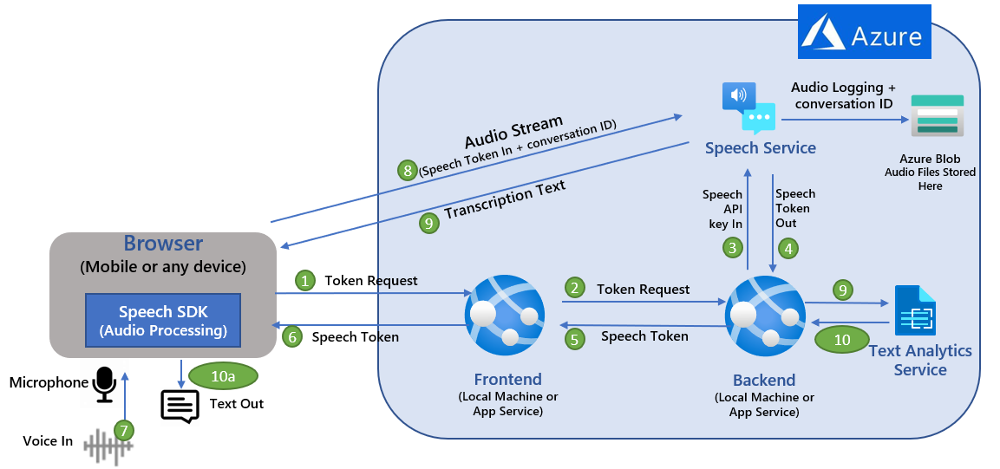

# Real-time Transcription using Azure Speech in ReactJS

This sample simulates call center intelligence in real-time using Azure AI services. The code also records the conversation to Azure storage using the conversation ID provided by the user on web UI.

This sample shows design pattern examples for authentication token exchange and management, as well as capturing audio from a microphone or file for speech-to-text conversions.

Below architecture diagram depicts key components and API/communication sequence used in this sample


This sample uses Express.js backend framework which allows you to make http calls from any front end. ReactJS is used for frontend app. *NOTE*: This sample is only using the Azure Speech SDK - it does not use Azure Bot Service and Direct Line Speech channel.

* **Express.js**: Express is a minimal and flexible Node.js web application framework that provides a robust set of features for web and mobile applications. It facilitates the rapid development of Node based web applications.

* **React.js** often referred to as React or ReactJS is a JavaScript library responsible for building a hierarchy of UI components or in other words, responsible for the rendering of UI components. It provides support for both frontend and server-side.

## Prerequisites

1. This article assumes that you have an Azure account and Speech service subscription. If you don't have an account and subscription, [try the Speech service for free](https://docs.microsoft.com/azure/cognitive-services/speech-service/overview#try-the-speech-service-for-free).
1. Ensure you have [Node.js](https://nodejs.org/en/download/) installed.

## How to run the app

1. Clone this repo. This repo has two apps as shown in the architecture diagram above: 
    * speechreactfrontend folder is for the "ReactJS Frontend" component and
    * speechexpressbackend folder is for the "ExpressJS Backend" component 


2. **Prepare and run the Speech service Express.js backend**
    -	Go to speechexpressbacked directory and run `npm install -all` to install dependencies.
    -	Update the “.env” file with your Azure Speech service key and Azure region. Azure Region value examples: “eastus2”, “westus”
    -	Start Speech service backend app by running `‘npm start’`
    -	If you are running this locally then try accessing below URLs from browser to verify that the backend component is working as expected
        *	`http://localhost:8080/api/sayhello`
        *	`http://localhost:8080/api/get-speech-token`
    -	If you have deployed speechexpressbacked app to Azure App Service (as per instructions below) then you can verify using URLs from browser as below:
        *	`https://<<your backend Azure App service name>>/api/sayhello`
        *	`https://<<your backend Azure App service name>>/api/get-speech-token`
3.	**Prepare and run the Speech client React.js frontend**
    +	Go to speechreactfrontend directory and run `npm install -all` to install dependencies.
    +	Update “package.json” as following. Set value of “proxy” depending on where your Express.js backend is running. 
    +	If Express.js backend “speechexpressbacked” running on local machine then use `"proxy": "http://localhost:8080"`
    +	If Express.js backend “speechexpressbacked”running on Azure. Use `"proxy": https://<<your backend Azure App service name>>.azurewebsites.net`
    +	Open a browser and go to `http://localhost:3000` to access the app. Click on the microphone icon on the web page and start talking. You should see transcription displayed on the web page in real-time (an example shown below).


    


    +	If you have also deployed the frontend ReactJS to Azure App Service then use the deployed app service URL which you can find on Azure portal for your App Service. Example: `https://myspeechreactfrontend.azurewebsites.net`


## Deploying sample code to Azure App Service
You can deploy your Node.js app using VS Code and the Azure App Service extension. Follow instructions [Deploy NodeJS using Azure App Service]:https://docs.microsoft.com/en-us/azure/app-service/quickstart-nodejs?pivots=platform-linux#deploy-to-azure that explains how to deploy any node app to Azure App Service. 

* To deploy **speechexpressbacked** to Azure App Service, select the “speechexpressbacked” as the root folder when prompted in the VS code. 
    - Validate that your ExpressJS backend is successfully deployed by trying to access one of the two APIs hosted by your backend
    - `https://<<your backend Azure App service name>>/api/sayhello`
    - `https://<<your backend Azure App service name>>/api/get-speech-token`

* Similarly, you can deploy **speechreactfrontend** to another Azure App Service instance by selecting the root folder for this app. This sample assumes that you are deploying the frontend and the backend app on a **separate** app service instance.
    - Before deploying your “speechreactfrontend”, update “package.json”. Set the value of “proxy” pointing it to the “speechexpressbacked” App Service URL. Use `"proxy": https://<<your backend Azure App service name>>.azurewebsites.net`
    - Deploy your frontend after updating package.json.
    - You should now be able to access the web app and do real-time transcription from a browser from your mobile phone or any other device that can access the app service url. 

## Issues and resolutions

| Issues/Errors | Resolutions |
| :-------------| :-----------|
| **Invalid Host Header** error in the browser when running the React Front end | Add DANGEROUSLY_DISABLE_HOST_CHECK=true in the .env for the front end. This solution is not recommended for production deployment. This is to enable a quick demonstration of real-time speech streaming capability using the web browser. |
|Express.js backend API not accessible when deployed to Azure app service. | Verify that the port used by the express backend (in serverapp.js) is using value <code>‘process.env.WEB_PORT &#124;&#124; 8080’ </code>|


## Change recognition language

To change the source recognition language, change the locale strings in `App.js` lines **32** and **66**, which sets the recognition language property on the `SpeechConfig` object.

```javascript
speechConfig.speechRecognitionLanguage = 'en-US'
```

For a full list of supported locales, see the [language support article](https://docs.microsoft.com/azure/cognitive-services/speech-service/language-support#speech-to-text).

## Speech-to-text from microphone

To convert speech-to-text using a microphone, run the app and then click **Convert speech to text from your mic.**. This will prompt you for access to your microphone, and then listen for you to speak. The following function `sttFromMic` in `App.js` contains the implementation.

```javascript
async sttFromMic() {
    const tokenObj = await getTokenOrRefresh();
    const speechConfig = speechsdk.SpeechConfig.fromAuthorizationToken(tokenObj.authToken, tokenObj.region);
    speechConfig.speechRecognitionLanguage = 'en-US';
    
    const audioConfig = speechsdk.AudioConfig.fromDefaultMicrophoneInput();
    const recognizer = new speechsdk.SpeechRecognizer(speechConfig, audioConfig);

    this.setState({
        displayText: 'speak into your microphone...'
    });

    recognizer.recognizeOnceAsync(result => {
        let displayText;
        if (result.reason === ResultReason.RecognizedSpeech) {
            displayText = `RECOGNIZED: Text=${result.text}`
        } else {
            displayText = 'ERROR: Speech was cancelled or could not be recognized. Ensure your microphone is working properly.';
        }

        this.setState({
            displayText: displayText
        });
    });
}
```

Running speech-to-text from a microphone is done by creating an `AudioConfig` object and using it with the recognizer.

```javascript
const audioConfig = speechsdk.AudioConfig.fromDefaultMicrophoneInput();
const recognizer = new speechsdk.SpeechRecognizer(speechConfig, audioConfig);
```

## Speech-to-text from file

To convert speech-to-text from an audio file, run the app and then click **Convert speech to text from an audio file.**. This will open a file browser and allow you to select an audio file. The following function `fileChange` is bound to an event handler that detects the file change. 

```javascript
async fileChange(event) {
    const audioFile = event.target.files[0];
    console.log(audioFile);
    const fileInfo = audioFile.name + ` size=${audioFile.size} bytes `;

    this.setState({
        displayText: fileInfo
    });

    const tokenObj = await getTokenOrRefresh();
    const speechConfig = speechsdk.SpeechConfig.fromAuthorizationToken(tokenObj.authToken, tokenObj.region);
    speechConfig.speechRecognitionLanguage = 'en-US';

    const audioConfig = speechsdk.AudioConfig.fromWavFileInput(audioFile);
    const recognizer = new speechsdk.SpeechRecognizer(speechConfig, audioConfig);

    recognizer.recognizeOnceAsync(result => {
        let displayText;
        if (result.reason === ResultReason.RecognizedSpeech) {
            displayText = `RECOGNIZED: Text=${result.text}`
        } else {
            displayText = 'ERROR: Speech was cancelled or could not be recognized. Ensure your microphone is working properly.';
        }

        this.setState({
            displayText: fileInfo + displayText
        });
    });
}
```

You need the audio file as a JavaScript [`File`](https://developer.mozilla.org/en-US/docs/Web/API/File) object, so you can grab it directly off the event target using `const audioFile = event.target.files[0];`. Next, you use the file to create the `AudioConfig` and then pass it to the recognizer.

```javascript
const audioConfig = speechsdk.AudioConfig.fromWavFileInput(audioFile);
const recognizer = new speechsdk.SpeechRecognizer(speechConfig, audioConfig);
```

## Token exchange process

This sample application shows an example design pattern for retrieving and managing tokens, a common task when using the Speech JavaScript SDK in a browser environment. A simple Express back-end is implemented in the same project under `server/index.js`, which abstracts the token retrieval process. 

The reason for this design is to prevent your speech key from being exposed on the front-end, since it can be used to make calls directly to your subscription. By using an ephemeral token, you are able to protect your speech key from being used directly. To get a token, you use the Speech REST API and make a call using your speech key and region. In the Express part of the app, this is implemented in `index.js` behind the endpoint `/api/get-speech-token`, which the front-end uses to get tokens. 

```javascript
app.get('/api/get-speech-token', async (req, res, next) => {
    res.setHeader('Content-Type', 'application/json');
    const speechKey = process.env.SPEECH_KEY;
    const speechRegion = process.env.SPEECH_REGION;

    if (speechKey === 'paste-your-speech-key-here' || speechRegion === 'paste-your-speech-region-here') {
        res.status(400).send('You forgot to add your speech key or region to the .env file.');
    } else {
        const headers = { 
            headers: {
                'Ocp-Apim-Subscription-Key': speechKey,
                'Content-Type': 'application/x-www-form-urlencoded'
            }
        };

        try {
            const tokenResponse = await axios.post(`https://${speechRegion}.api.cognitive.microsoft.com/sts/v1.0/issueToken`, null, headers);
            res.send({ token: tokenResponse.data, region: speechRegion });
        } catch (err) {
            res.status(401).send('There was an error authorizing your speech key.');
        }
    }
});
```

In the request, you create a `Ocp-Apim-Subscription-Key` header, and pass your speech key as the value. Then you make a request to the **issueToken** endpoint for your region, and an authorization token is returned. In a production application, this endpoint returning the token should be *restricted by additional user authentication* whenever possible. 

On the front-end, `token_util.js` contains the helper function `getTokenOrRefresh` that is used to manage the refresh and retrieval process. 

```javascript
export async function getTokenOrRefresh() {
    const cookie = new Cookie();
    const speechToken = cookie.get('speech-token');

    if (speechToken === undefined) {
        try {
            const res = await axios.get('/api/get-speech-token');
            const token = res.data.token;
            const region = res.data.region;
            cookie.set('speech-token', region + ':' + token, {maxAge: 540, path: '/'});

            console.log('Token fetched from back-end: ' + token);
            return { authToken: token, region: region };
        } catch (err) {
            console.log(err.response.data);
            return { authToken: null, error: err.response.data };
        }
    } else {
        console.log('Token fetched from cookie: ' + speechToken);
        const idx = speechToken.indexOf(':');
        return { authToken: speechToken.slice(idx + 1), region: speechToken.slice(0, idx) };
    }
}
```

This function uses the `universal-cookie` library to store and retrieve the token from local storage. It first checks to see if there is an existing cookie, and in that case it returns the token without hitting the Express back-end. If there is no existing cookie for a token, it makes the call to `/api/get-speech-token` to fetch a new one. Since we need both the token and its corresponding region later, the cookie is stored in the format `token:region` and upon retrieval is spliced into each value.

Tokens for the service expire after 10 minutes, so the sample uses the `maxAge` property of the cookie to act as a trigger for when a new token needs to be generated. It is reccommended to use 9 minutes as the expiry time to act as a buffer, so we set `maxAge` to **540 seconds**.

In `App.js` you use `getTokenOrRefresh` in the functions for speech-to-text from a microphone, and from a file. Finally, use the `SpeechConfig.fromAuthorizationToken` function to create an auth context using the token.

```javascript
const tokenObj = await getTokenOrRefresh();
const speechConfig = speechsdk.SpeechConfig.fromAuthorizationToken(tokenObj.authToken, tokenObj.region);
```

In many other Speech service samples, you will see the function `SpeechConfig.fromSubscription` used instead of `SpeechConfig.fromAuthorizationToken`, but by **avoiding the usage** of `fromSubscription` on the front-end, you prevent your speech subscription key from becoming exposed, and instead utilize the token authentication process. `fromSubscription` is safe to use in a Node.js environment, or in other Speech SDK programming languages when the call is made on a back-end, but it is best to avoid using in a browser-based JavaScript environment.