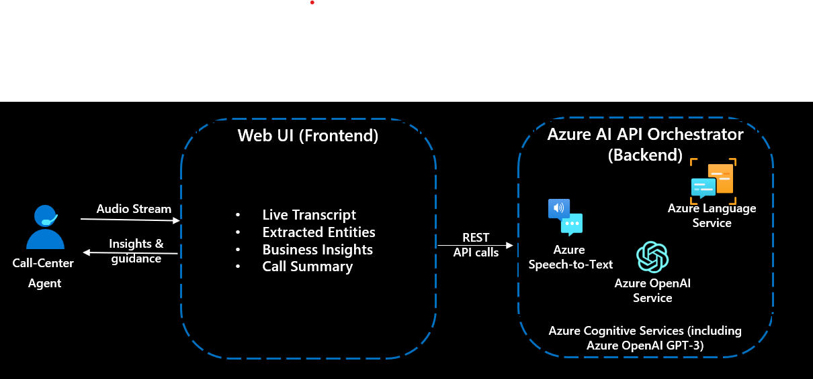
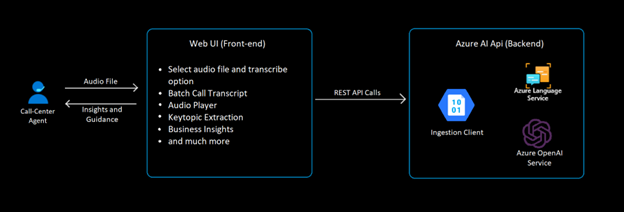
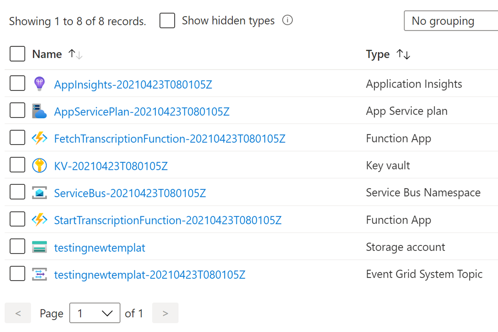
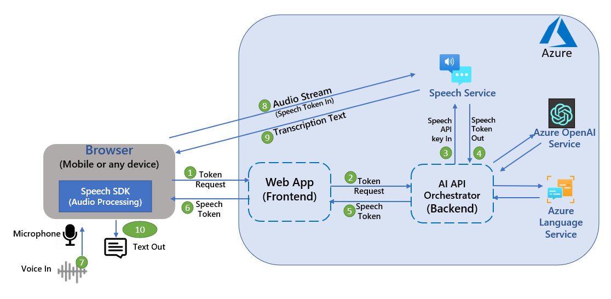

# Azure AI (including Azure OpenAI) - powered Conversation Intelligence

This solution component provides both real-time and batch transcription and analysis of a call to improve customer experience by extracting custom business insights. This solution can help with agent-assist and virtual agents use cases. Key technical components of this part of the accelerator are:
    * Transcription of live audio stream using Azure Speech Service (for Live)
    * Transcription of dual channel call-center audio via Ingestion Client which uses Azure Speech Service (for Batch)
    * Entity extraction + PII detection and redaction using Azure Language Service
    * Conversation summarization using Azure OpenAI Service
    * Extract business insights & conversation details using Azure OpenAI Service

Live mode simulates call center intelligence in real-time using Azure AI services. It uses Azure Speech SDK to capture audio from a microphone and convert it to text. The text is then sent to Azure Language service to extract entities, key phrases, and detect+ redact PII information. The data is then displayed on a web page in real-time using streaming pattern.

The web provides an option to select business domain for a specific conversation. The domain is used to select the appropriate OpenAI prompt to extract key business information.

Batch mode transcribes dual-channel call center recordings and extracts valuable information such as Personal Identifiable Information (PII), sentiment, and other valuable key insights. 

When the user selects an audio file and click the ‘Transcribe’ button, an API is called which handles the upload process of that file into the Ingestion Client’s Container. Then, the audio is transcribed using Azure Speech Service and further stored in another container. At last, the generated transcript is fetched and displayed in the correct format onto the UI.

Once the transcript is done, it is sent to Azure OpenAI service to summarize the call. Azure OpenAI service is also used to parse raw call transcripts and extract key business information using domain specific prompts. The data is then displayed in web page UI.
This sample shows design pattern examples for authentication token exchange and management, as well as speech-to-text conversions.

Below diagram depicts key components and API/communication used in the live mode


Below diagram depicts key components and API/communication used in the Batch mode


This sample uses Express.js backend framework which allows you to make http calls from any front end. ReactJS is used for the frontend app. *NOTE*: This sample is only using the Azure Speech SDK - it does not use Azure Bot Service and Direct Line Speech channel.

* **ai-app-backend**: `ai-app-backend` is an Express-based backend API app. Express is a minimal and flexible Node.js web application framework that provides a robust set of features for web and mobile applications. It facilitates the rapid development of Node based web applications.

* **web-app-frontend** `web-app-frontend` is a React-based web frontend app. React.js often referred to as React or ReactJS is a JavaScript library responsible for building a hierarchy of UI components or in other words, responsible for the rendering of UI components. It provides support for both the front-end and server-side.

## Prerequisites

1. This article assumes that you have an Azure account. If you don't have an Azure account and subscription, [try the Azure account for free] (https://azure.microsoft.com/en-us/free/search/).
2. Create a [Azure Speech resource] (https://portal.azure.com/#create/Microsoft.CognitiveServicesSpeechServices) in the Azure portal.
3. Create a [Azure Language resource] (https://portal.azure.com/#create/Microsoft.CognitiveServicesTextAnalytics) in the Azure portal.
4. Optionally, create a [Azure OpenAI resource] (https://portal.azure.com/?microsoft_azure_marketplace_ItemHideKey=microsoft_openai_tip#create/Microsoft.CognitiveServicesOpenAI?WT.mc_id=academic-84928-cacaste) in the Azure portal. Note: OpenAI is currently in preview and is not available in all regions. You can check the [OpenAI documentation] (https://docs.microsoft.com/en-us/azure/cognitive-services/openai/overview?WT.mc_id=academic-84928-cacaste) for more information.
5. Deploy the provided ArmTemplateBatch.json file and configure the Ingestion Client in Azure Portal. (For Batch Mode)
   Steps for deploying and configuring the client are listed below.
6. Install [Node.js] (https://nodejs.org/en/download/) on your laptop to run the frontend and backend apps on your local machine.

## How to Setup and Run this solution component

1. Clone this repo. This repo has two apps as shown in the architecture diagram above: 
    * web-app-frontend folder is for the "ReactJS Frontend" web UI component and
    * ai-app-backend folder is for the "ExpressJS Backend" API backend component 


2. **Prepare and run the backend app (in folder ai-app-backend)**
    -	Go to the ai-app-backend directory and run `npm install -all` to install dependencies.
    -	Update the “config.json” file with your Azure Speech service key (speech_subscription_key property) and Azure region (speech_region property). Azure Region value examples: “eastus2”, “westus”
    -	Update the “config.json” file with your Azure Language service key (text_analytics_key property) and endpoint (text_analytics_endpoint property). 
    -	Update the “config.json” file with your Azure OpenAI service key (openai_key property), endpoint (openai_endpoint property) and deployment name (openai_deployment_name property).
    -   For supporting Batch, update the ".env" file with your Ingestion Client container's connection string (LOCALE-ID_CONNECTION_STRING) and make sure to keep the AZURE_STORAGE_CONTAINER_NAME as"audio-input".
	-	Start backend AI API app by running `‘npm start’`
    -	If you are running this locally then try accessing the below URLs from browser to verify that the backend component is working as expected
        *	`http://localhost:8080/api/sayhello`
        *	`http://localhost:8080/api/get-speech-token`
    -	If you have deployed ai-app-backend app to Azure App Service (as per instructions below) then you can verify using URLs from browser as below:
        *	`https://<<your backend Azure App service name>>/api/sayhello`
        *	`https://<<your backend Azure App service name>>/api/get-speech-token`
3.	**Prepare and run the frontend app for web UI (in folder web-app-frontend)**
    +	Go to web-app-frontend directory and run `npm install -all` to install dependencies.
    +	Update “package.json” as following. Set value of “proxy” depending on where your Express.js backend is running. 
    +   Start frontend web app by running `‘npm start’`
    +	If Express.js backend “ai-app-backend” running on local machine then use `"proxy": "http://localhost:8080"`
    +	If Express.js backend “ai-app-backend”running on Azure. Use `"proxy": https://<<your backend Azure App service name>>.azurewebsites.net`
    +	Open a browser and go to `http://localhost:3000` to access the app. 
    +   On the web UI, select a business domain that alings best with your conversation scenario from the "Choose Conversation Scenario" dropbox.
    +   Click on the "Click HERE and START Talking" button on the web page and start talking. You should see transcription displayed on the web page in real-time (an example shown below).
**LIVE Window**
    

**BATCH Window**


 


+	If you have also deployed the frontend ReactJS to Azure App Service then use the deployed app service URL which you can find on Azure portal for your App Service. Example: `https://myweb-app-frontend.azurewebsites.net`

##Steps to set up Ingestion Client through Azure Portal

Follow the instructions given below:
1.	In the Azure portal, click Create a Resource. In the search box, type template deployment, and select the Template deployment resource.
2.	On the screen that appears, choose Template deployment (deploy using custom templates) and click the Create button.
You will be creating Azure resources from the ARM template we provided in the >ai-app-backend>Template folder.

3.	Click on the Build your own template in the editor link.  

 
4.	Load the template by clicking Load file. Alternatively, you could copy/paste the template in the editor.

  
5.	Once the template text is loaded you will be able to read and edit the transcript. Do NOT attempt any edits at this stage. You need to save the template you loaded, so click the Save button.
Saving the template will result in the screen below. You will need to fill in the form provided. It is important that all the information is correct. Let us look at the form and go through each field.
•	Pick the Azure Subscription Id where you will create the resources.
•	Either pick or create a resource group. (It would be better to have all the Ingestion Client resources within the same resource group, so we suggest you create a new resource group.)
•	Pick a region. This can be the same region as your Azure Speech key.
**FILL OUT ALL REQUIRED FIELD HIGHLIGHTED IN THE RED BOX**  


**Note: Select ‘Locale’ value as per the locale of the audio**


6.	Press Create to create resources. It typically takes 1-2 mins. The resources are listed below. 
    


**Note: In case you want support for one or more locales, deploy the template for each locale separately and store the connection string for the container of each locale in the .env file inside ai-app-backend folder**

7. Make sure to store the connection string for the container in the .env file inside ai-app-backend folder.

To know more about the Ingestion Client, its architecture and working, please refer: 
AI-Powered-Call-Center-Intelligence/postcall-analytics-azure at main · amulchapla/AI-Powered-Call-Center-Intelligence · GitHub


## Deploying sample code to Azure App Service
You can deploy your Node.js app using VS Code and the Azure App Service extension. Follow instructions [Deploy NodeJS using Azure App Service]:https://docs.microsoft.com/en-us/azure/app-service/quickstart-nodejs?pivots=platform-linux#deploy-to-azure that explains how to deploy any node app to Azure App Service. 

* To deploy **ai-app-backend** to Azure App Service, select the “ai-app-backend” as the root folder when prompted in the VS code. 
    - Validate that your ExpressJS backend is successfully deployed by trying to access one of the two APIs hosted by your backend
    - `https://<<your backend Azure App service name>>/api/sayhello`
    - `https://<<your backend Azure App service name>>/api/get-speech-token`

* Similarly, you can deploy **web-app-frontend** to another Azure App Service instance by selecting the root folder for this app. This sample assumes that you are deploying the frontend and the backend app on a **separate** app service instance.
    - Before deploying your “web-app-frontend”, update “package.json”. Set the value of “proxy” pointing it to the “ai-app-backend” App Service URL. Use `"proxy": https://<<your backend Azure App service name>>.azurewebsites.net`
    - Deploy your frontend after updating package.json.
    - You should now be able to access the web app and do real-time transcription from a browser from your mobile phone or any other device that can access the app service url. 

## Issues and resolutions

<table>
<tr>
<td> Issue/Error </td> <td> Resolutions </td>
</tr>
<tr>
<td> **Frontend app initialization error** You might get SSL related errors when starting the frontend web app depending on the node version that's installed on your laptop. Error could be ERR_OSSL_EVP_UNSUPPORTED or similar. </td>
<td>


In the web-app-frontend folder, in the package.json, try to change this:
```json
"scripts": {
    "start": "react-scripts start",
    "build": "react-scripts build",
    "test": "react-scripts test",
    "eject": "react-scripts eject"
  },
```
To

```json
"scripts": {
    "start": "react-scripts --openssl-legacy-provider start",
    "build": "react-scripts --openssl-legacy-provider build",
    "test": "react-scripts test",
    "eject": "react-scripts eject"
  },
``` 
That might fix the issue


</td>
</tr>
<tr>
<td> "Invalid Host Header" error in the browser when running the web Frontend </td>
<td>

Add DANGEROUSLY_DISABLE_HOST_CHECK=true in the .env for the front end. This solution is not recommended for production deployment. This is to enable a quick demonstration of real-time speech streaming capability using the web browser. 

</td>
</tr>
</table>


## Change recognition language

To change the source recognition language, change the locale strings in `App.js` lines **32** and **66**, which sets the recognition language property on the `SpeechConfig` object.

```javascript
speechConfig.speechRecognitionLanguage = 'en-US'
```

For a full list of supported locales, see the [language support article](https://docs.microsoft.com/azure/cognitive-services/speech-service/language-support#speech-to-text).

## Speech-to-text from microphone

To convert speech-to-text using a microphone, run the app and then click **Convert speech to text from your mic.**. This will prompt you for access to your microphone, and then listen for you to speak. The following function `sttFromMic` in `App.js` contains the implementation.

```javascript
async sttFromMic() {
    const tokenObj = await getTokenOrRefresh();
    const speechConfig = speechsdk.SpeechConfig.fromAuthorizationToken(tokenObj.authToken, tokenObj.region);
    speechConfig.speechRecognitionLanguage = 'en-US';
    
    const audioConfig = speechsdk.AudioConfig.fromDefaultMicrophoneInput();
    const recognizer = new speechsdk.SpeechRecognizer(speechConfig, audioConfig);

    this.setState({
        displayText: 'speak into your microphone...'
    });

    recognizer.recognizeOnceAsync(result => {
        let displayText;
        if (result.reason === ResultReason.RecognizedSpeech) {
            displayText = `RECOGNIZED: Text=${result.text}`
        } else {
            displayText = 'ERROR: Speech was cancelled or could not be recognized. Ensure your microphone is working properly.';
        }

        this.setState({
            displayText: displayText
        });
    });
}
```

Running speech-to-text from a microphone is done by creating an `AudioConfig` object and using it with the recognizer.

```javascript
const audioConfig = speechsdk.AudioConfig.fromDefaultMicrophoneInput();
const recognizer = new speechsdk.SpeechRecognizer(speechConfig, audioConfig);
```


## Token exchange process

This sample application shows an example design pattern for retrieving and managing tokens, a common task when using the Speech JavaScript SDK in a browser environment. A simple Express back-end is implemented in the same project under `server/index.js`, which abstracts the token retrieval process. 

The reason for this design is to prevent your speech key from being exposed on the front-end, since it can be used to make calls directly to your subscription. By using an ephemeral token, you are able to protect your speech key from being used directly. To get a token, you use the Speech REST API and make a call using your speech key and region. In the Express part of the app, this is implemented in `index.js` behind the endpoint `/api/get-speech-token`, which the front-end uses to get tokens. 

Below diagram depicts key sequences during the token exchange process (and overall AI API orchestration done by the backend component) in this sample.


In the request, you create a `Ocp-Apim-Subscription-Key` header, and pass your speech key as the value. Then you make a request to the **issueToken** endpoint for your region, and an authorization token is returned. In a production application, this endpoint returning the token should be *restricted by additional user authentication* whenever possible. 

On the front-end, `token_util.js` contains the helper function `getTokenOrRefresh` that is used to manage the refresh and retrieval process. 

This function uses the `universal-cookie` library to store and retrieve the token from local storage. It first checks to see if there is an existing cookie, and in that case it returns the token without hitting the Express back-end. If there is no existing cookie for a token, it makes the call to `/api/get-speech-token` to fetch a new one. Since we need both the token and its corresponding region later, the cookie is stored in the format `token:region` and upon retrieval is spliced into each value.

Tokens for the service expire after 10 minutes, so the sample uses the `maxAge` property of the cookie to act as a trigger for when a new token needs to be generated. It is reccommended to use 9 minutes as the expiry time to act as a buffer, so we set `maxAge` to **540 seconds**.

In `App.js` you use `getTokenOrRefresh` in the functions for speech-to-text from a microphone, and from a file. Finally, use the `SpeechConfig.fromAuthorizationToken` function to create an auth context using the token.

```javascript
const tokenObj = await getTokenOrRefresh();
const speechConfig = speechsdk.SpeechConfig.fromAuthorizationToken(tokenObj.authToken, tokenObj.region);
```

In many other Speech service samples, you will see the function `SpeechConfig.fromSubscription` used instead of `SpeechConfig.fromAuthorizationToken`, but by **avoiding the usage** of `fromSubscription` on the front-end, you prevent your speech subscription key from becoming exposed, and instead utilize the token authentication process. `fromSubscription` is safe to use in a Node.js environment, or in other Speech SDK programming languages when the call is made on a back-end, but it is best to avoid using in a browser-based JavaScript environment.


## DISCLAIMER

This presentation, demonstration, and demonstration model are for informational purposes only and (1) are not subject to SOC 1 and SOC 2 compliance audits, and (2) are not designed, intended or made available as a medical device(s) or as a substitute for professional medical advice, diagnosis, treatment or judgment. Microsoft makes no warranties, express or implied, in this presentation, demonstration, and demonstration model. Nothing in this presentation, demonstration, or demonstration model modifies any of the terms and conditions of Microsoft’s written and signed agreements. This is not an offer and applicable terms and the information provided are subject to revision and may be changed at any time by Microsoft.

This presentation, demonstration, and demonstration model do not give you or your organization any license to any patents, trademarks, copyrights, or other intellectual property covering the subject matter in this presentation, demonstration, and demonstration model.

The information contained in this presentation, demonstration and demonstration model represents the current view of Microsoft on the issues discussed as of the date of presentation and/or demonstration, for the duration of your access to the demonstration model. Because Microsoft must respond to changing market conditions, it should not be interpreted to be a commitment on the part of Microsoft, and Microsoft cannot guarantee the accuracy of any information presented after the date of presentation and/or demonstration and for the duration of your access to the demonstration model.

No Microsoft technology, nor any of its component technologies, including the demonstration model, is intended or made available as a substitute for the professional advice, opinion, or judgment of (1) a certified financial services professional, or (2) a certified medical professional. Partners or customers are responsible for ensuring the regulatory compliance of any solution they build using Microsoft technologies.
