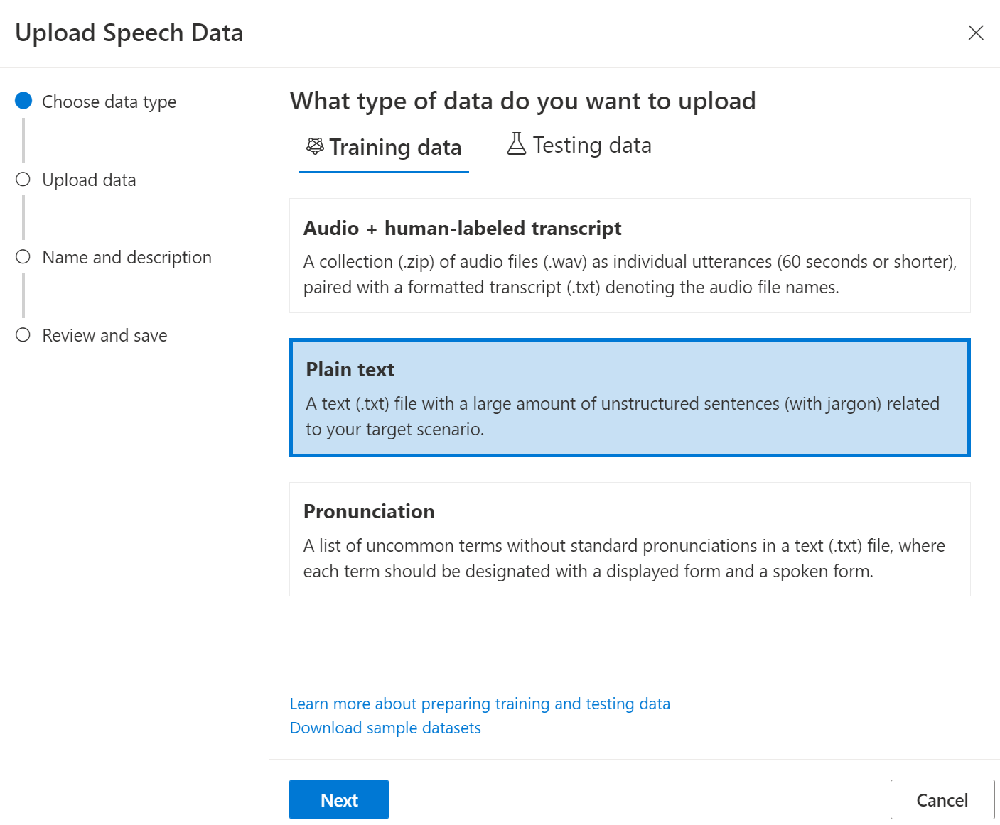
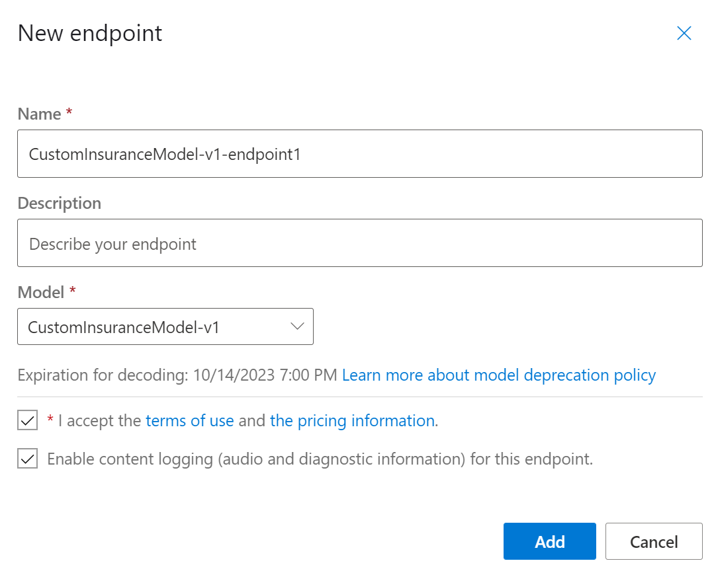
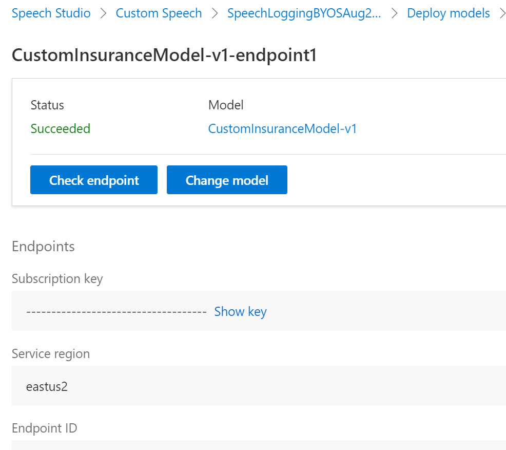

## What is Custom Speech?

Azure [Custom Speech](https://docs.microsoft.com/en-us/azure/cognitive-services/speech-service/custom-speech-overview) is a set of online tools that allow you to evaluate and improve the Microsoft speech-to-text accuracy for your applications, tools, and products. This powerful feature will be used in this sample to customize the Azure speech model for Insurance language - this helps model more accurately transcribe insurance words and phrases. Similarly, you could use the Cusom Speech to customize the model for different business scenarios for different industries - medical, finance, manufactoring, retail etc.

# Steps to create & deploy a Custom Speech model

Before you can do anything with Custom Speech, you'll need an Azure account and a Speech service subscription. After you have an account, you can prep your data, train and test your models, inspect recognition quality, evaluate accuracy, and ultimately deploy and use the custom speech-to-text model.

This diagram highlights the pieces that make up the [Custom Speech area of the Speech Studio](https://aka.ms/speechstudio/customspeech). Use the links below to learn more about each step.

1. [Bring your own storage (BYOS) for Speech logging](https://docs.microsoft.com/en-us/azure/cognitive-services/speech-service/speech-encryption-of-data-at-rest#bring-your-own-storage-byos-for-customization-and-logging) feature will be used to enable speech logging. Azure Speech Service supports automatically logging audio content to customer managed Azure storage account. This is very useful when you are using speech for real-time interaction and want the service to capture audio for post analysis, archival, compliance etc. This will allow us capture real-time audio for batch analytics. In this pattern, speech service will return transcription in real-time to the client and also capture audio in the Azure storage account specified here. `You might have to request access to this preview feature. Follow instructions [here](https://docs.microsoft.com/en-us/azure/cognitive-services/speech-service/speech-encryption-of-data-at-rest#bring-your-own-storage-byos-for-customization-and-logging)'

2. [Create Speech Service resource](https://ms.portal.azure.com/#create/Microsoft.CognitiveServicesSpeechServices). Create a Speech service resource using Azure portal. Select “Yes” for bring your own storage box when creating a new Azure Speech service resource. `NOTE: You need to create a Speech Resource with a paid (S0) key. The free key account will not work for the batch analytics step.`

3. `Create a new custom speech project` on [Speech Studio](https://speech.microsoft.com/customspeech) using the newly created speech resource from the previous step. Content like data, models, tests, and endpoints are organized into *projects* in the [Speech Studio](https://speech.microsoft.com/customspeech). Each project is specific to a domain and country/language. For example, you might create a project for call centers that use English in the United States.

To create your first project, select **Speech-to-text/Custom speech**, and then select **New Project**. Follow the instructions provided by the wizard to create your project. After you create a project, you should see four tabs: **Data**, **Testing**, **Training**, and **Deployment**. 

4. Upload test data to customize the speech model for business lanaguage and terms. You can use sample language adaptation data provided under `azure-custom-speech\sampledata\InsuranceLanguage-Data1.txt`. Select "Plain text" as the data type when uploading txt file as shown below.

5. `Train a model`. Improve the accuracy of your speech-to-text model by providing related text (<200 MB). This data helps to train the speech-to-text model. 

6. `Deploy a model`. After training, if you're satisfied with the result, you can deploy your model to a custom endpoint. Create a new custom endpoint and select “Enable content logging (audio and diagnostic information) for this endpoint.” as shown in screenshot below.

7. `Get Custom Speech Model Endpoint ID`- Once you have successully deployed a custom speech model. click on the deployed model and get the "Endpoint ID" as shown below. You will need the "Endpoint ID", "Service region" and "Subscription Key" in the next step. 

